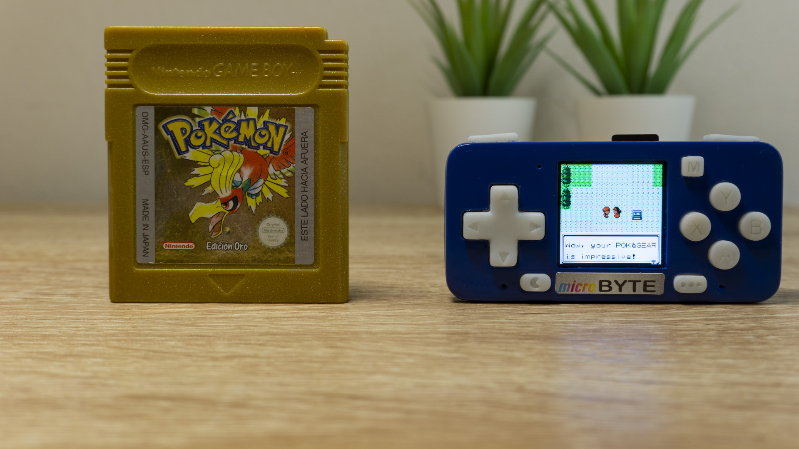
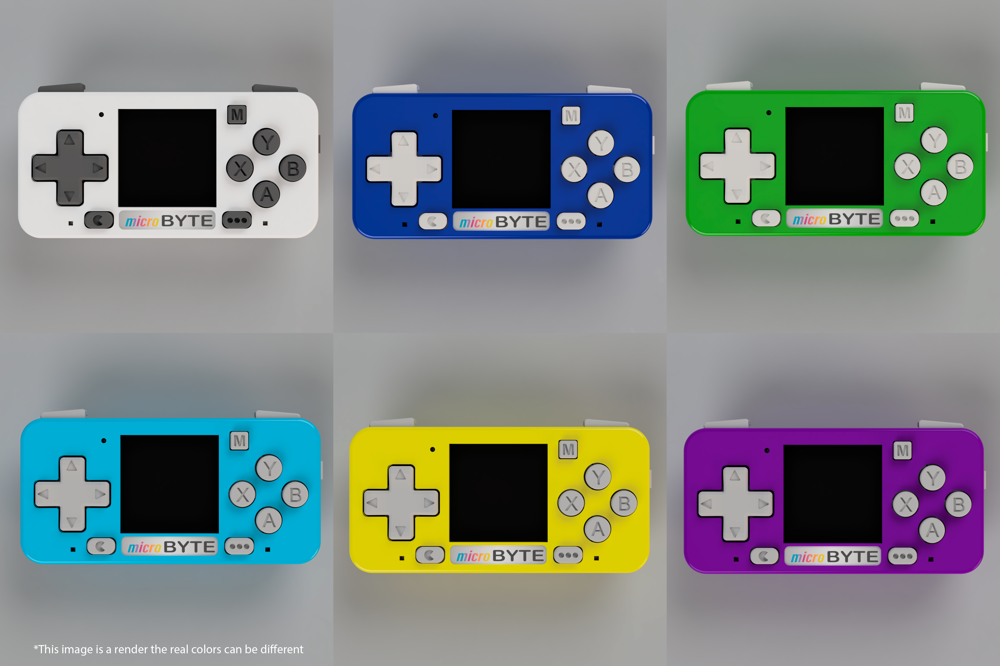

MicroByte is an open-source retro hand-held console which can execute games from classic 8Bit consoles in a colorful and high pixel density IPS screen with a very little dimension. And anyone can modify/improve the firmware, case or PCB because is open source.

In this repo you can find the submodules to all the part of the project (PCB, case and firmware).

- [PCB](https://github.com/jfm92/microByte_PCB)
- [Case](https://github.com/jfm92/microByte_case)
- [Firmware](https://github.com/jfm92/microByte_firmware)

## Youtube Video

# Features

This device is mainly focus run emulators, trying to achieve as best performance as possible. But thanks to the flexibility of the development environment, it was implemented some extra features which will be explained on the next points.

## Software.

This hand-held console can emulate for now the next list of 8Bit emulators:
- [NES](images/microByte_nes_contra.JPG).
- [GameBoy](images/microByte_gb_donkey.JPG).
- [GameBoy Color](images/microByte_gbc_zelda.JPG).
- [Sega Master System](images/microByte_sms_outrun.JPG).
- [GameGear](images/microByte_gg_sonic.JPG).

(Clicking the name of the console you can see an image of a game on each console, but it's important to know that my camera is not able to capture the real colors and definition of the mounted display.).

On the other hand, it's possible to execute Arduino Sketches binaries and ESP-IDF binaries in run time in a similar way as an App in a smartphone.

Going deeper into the software, it was designed with a modular structure which simplifies the development and/or performance improvements.

Finally, to control this device we use [LVGL](https://lvgl.io/) as graphical user interface library. This library allows us to create very modern and clean looking interface, with very low memory usage.

## Hardware

This is a list of the hardware specifications:

- CPU: ESP32 Wrover E
- RAM: 8 MByte
- Flash: 16MByte
- Li-Po battery charge and over-discharge circuit protection.
- USB-C connection.
- Battery 500 mAh with up to 6 hours of autonomy.
- Screen: ST7789 IPS display with 1.3" of diagonal and 240x240 pixels of definition (44307 DPI).
- Digital Audio amplifier (I2S) with SMT speaker. (Behind the top little hole is the speaker).

Once we already see the specifications it worth a special mention to the controllers which has the next configuration:

- Four dome buttons (Start, Select and R/L Trigger).
- Eight inductive button with rubber membrane.

The usage rubber membrane and inductive pad is to get a similar GameBoy experience. This give a mix "Clicky" and soft touch.

# Customizable

The case was design with being 3D printer friendly. This means that you can 3D print easily to obtain a unique version of your console with you desired filament or resin.

In the next image you can see an example of how it could look in different combinations, in Andy Warhol style.

# Q&A

- Why to use SNES gamepad layout if only emulate 8Bit console?
    - Good question, because it only emulate 8Bit right now, but in future updates, probably it will be added some new 16Bit emulators which needs this gamepad layout and on the other hand if you want to create an application you have enough buttons.

- Where I can buy?
    - At this moment is not available to sell, because is still a prototype and I need to improve a few things, but very soon you will be available.

- Will include the case? Will be 3D printed?
    - Yes, a case will be included. And no, the case won't be 3D printed, it will be done with Epoxy Resin.

- How can I modify the firmware?
    - You can find a document full of detail on the firmware repo.

- All the game works for each emulator?
    - Unfortunately, the short answer is no. Most of the games works properly but some has glitches or even doesn't start. But I'm working on give support for most of the games.

- How can I create a custom application?
    - The process will be explained on the use guide.

# Guide

WIP

# Credits

- **GameBoy & GameBoy Color emulator**: This emulator was developed by GNUBoy and adapted by HardKernel to the ESP32
- **NES emulator**: Is a modified version of Nofredo emulator. This adaptation to the ESP32 was done by Espressif, but I added some modifications to improve performance.
- **Sega Master System & GameGear**: This emulator was original developed by SMS Plus and modified by Espressif to adapt to the ESP32.
- **Graphical User Interface**: The GUI was developed using LVGL library.
- **GUI Icons**: The icons used on the graphical interface were obtained from [www.flaticon.es](https://www.flaticon.es), with premium license. If requeried can be provided.

