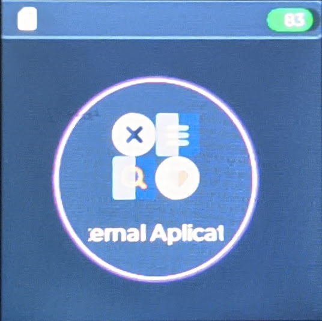

# microByte user manual

- [First Steps:](#first-steps-)
  * [Device overview:](#device-overview-)
  * [Prepare the SD card:](#prepare-the-sd-card-)
  * [How to add games:](#how-to-add-games-)
  * [How to add applications:](#how-to-add-applications-)
  * [Menu walkthrought:](#menu-walkthrought-)
- [Firmware update:](#firmware-update-)
- [Software development:](#software-development-)

## First Steps:

On the next point you will learn how to use your microByte and some advace feature such as software development or microPython.

Please read carrefully all the instructions and take special attention to the ``Prepare the SD card`` point.

### Device overview:

On the next images you can see the different parts of the device:

- Direction button: Use to navigate on the menu/games.
- Action buttons: On the menu, it's only use A to confirm an action, and B to cancel/return.
- Start/Select: Only use on games.
- Menu button: Open the on-game menu when you're running a game.
- Shoulder buttons: Only implement for custom applications or future emulators ports.
- Power button: Switch to turn on/off the device.
- USB connector: USB type c to **only** charge the device. 
- Battery Charge LED: This LED show the status of charging process, shinning in RED when the device is charging the battery and turn off when the charge is ready.
- Device status LED: This blue LED create animations to show the device status.
- microSD card slot: Slot to insert the microSD card. 

**Very important notice!**
Please take care of the orientation of the microSD card when you insert it on the device, the connector part of the card **must** be looking to the top part of the device.

### Menu overview:

(Sorry for the bad quality of the images)

The main menu is splitted into three tabs and status bar which shows information about the system:

  

#### Emulators tab:

This tab contains the list of emulators that are available to use:

  

Inside of each console you can find the games that you've added to your library, if you push ``A`` in one game, it will appear a menu showing if you want to start a fresh game, or in the case that you already save a game, it will show you if you want to resumen the game or delete the state save.

#### External applications tab:

You can find here a list of compatible .bin files. Just push A on any of the files and the application will be executed.

Note: Depend on the size of the file, it could take a while to execute it.

#### Configuration tab:

Here you can find a set of different configuration and information options.

- About this device: Tell you the hardware specs and the firmware version.
- Update firmware: It will show a list with the update files available on the SD card.
- Brightness: You can configure the brightness of the device. The changes will be save even if you turn off the device.
- GUI Color Mode: You can change the interface color to light or dark theme.
- Volumen: Set the sound level of the device.
- Disable/Enable Button State Save: This disable the instant save/load function from the X & Y buttons. If this option is enabled and you are playing a game, you can save the state of the game by pushing the button x and save state game pushing the button y.
-Battery status: Show detail info of the battery.
- Sd card Status: Show detail info of the microSD card. 

### Prepare the SD card:

**Note:** If you have premium version, you can skip this point because your microSD card is ready to work.

#### Requirements:

- microSD card class 10. (It should work with any size by I didn't test with very high capacity cards such as 256GB or 512GB)
- A PC(This tutorial is focus on Windows, but it's possible to do on any OS)
- microSD card reader.

Introduce your microSD card on your PC, check if the PC has detect the card. Once the card is ready, we will proceed to format it. To do so, go to ``My Computer``, and right-click on the card and select the option ``Format``. It should appear a windows like the next image:

(Tamaño de asignación predeterminado = default allocation size )

Be sure that you have the same configuration has on the image (red line), once you've set the right configuration, push ``Init`` button and it should take a few moments to complete. Once it's done a success message will appear.

The next step is to create the folder tree on your the SD card. With your **microByte turn off** introduce the microSD card on the SD slot. Then turn on the device, probably the device will reboot a few times. Once the menu appear, check if the SD card icon appear on the top bar. 
 
To be sure that everything goes fine, turn off the microByte and extract the microSD card, then connect it to the PC and open it. If everything goes fine, it should appear the next folders inside the card:

All right, now your microSD card is ready to be use on your microByte!

### How to add games:

** Please, be sure that you did previous step of prepare the microSD card **

Insert your microSD card in your PC. Once you open it you will see the next folder structure:

- apps
- Game_Gear
    - Save_Data
- GameBoy
    - Save_Data
- GameBoy Color
    - Save_Data
- Master_System
    - Save_Data
- NES
    - Save_Data
- SNES
    - Save_Data

To add a game, just open the folder of the console that you want to add a game, and copy there the uncompressed ROM file. Also you can manage you find your save sate game on on the ``Save_Data`` folder.

Once you insert again the microSD card on your device and turn it on, it should appear on the console tab.

**Disclaimer**
I don't provide any game ROM or file, the games that you add must be freeware or must owned by you previously.

### How to add applications:

** Please, be sure that you did previous step of prepare the microSD card **

Insert your microSD card in your PC. Once you open it you will see the next folder structure:

- apps
- Game_Gear
    - Save_Data
- GameBoy
    - Save_Data
- GameBoy Color
    - Save_Data
- Master_System
    - Save_Data
- NES
    - Save_Data
- SNES
    - Save_Data

You just need to copy your ``.bin`` file to the ``apps`` folder. The binary application it should appear on the External Applications menu. 

## Firmware update:

## microPython:

## Software development:

## Disclamer

